## キーボードに引きこもって生きて行きたい

---

### 目次

* キー配列
    * Ctrlキーの入力
    * 日本語入力切り替え
* 文字入力
    * カタカナ・英数変換
    * 記号の入力
    * Emacライクなキーバインド

---

### 目次(続き)

* キーボードフレンドリーなUIたち
    - ヘルプ表示もしくは、キーボードショットカット一覧表示
    - 絞り込み検索
    - 画面分割・タブ・ワークスペースなどのウィンドウ管理
    - Hit a Hint

---

### キー配列 : Ctrlキーの場所について

Ctrlキーって端っこにあって押すの面倒！

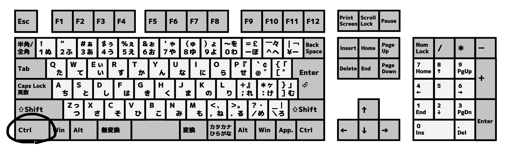

---

そこで、Caps Lockの位置にCtrlキーをマッピングしよう！

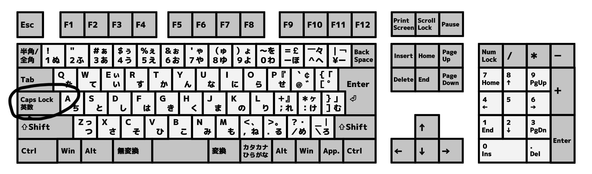

コメント：
Capc Lockって使用頻度低いくせに一等地に配置されているのは本当にゴミ！

---

## どうやるのか？

---

## Windowsの場合

* KeySwap : フリーソフト
* ctrl2cap : MicroSoftが提供しているツール

注意：
WindowsでCapsLockをCtrlにするには管理者権限が必要・・・。
それが厳しい場合は、ハード的な対応が良さそう。

---

## Ubuntuの場合

* gnome-tweaksという設定アプリをインストール後、「CapsLockをCtrlとして使う」を選択

---

## その他の方法

* RealForceというキーボード
    - 2,3万円位する。値段が高い
    - CapsLockキーとCtrlキーを入れ替えられる
    - 注意：入れ替え機能のみしか使えない。もとのCtrlキーは残したいのに、残念！
    - 最近発売されたR3モデルなら任意のキー割り当てができる！

---

## その他の方法2

* キーボードを改造する
    - 安いキーボードを適当に改造
    - 透明なシートに回路が印刷されている
        - カッター、アルミホイル、セロテープで十分
        - 接触不良には注意
        - 安いのだと回路も凄くシンプル

---

これで、Ctrlキーは快適に押せるようになった！
けど、まだ押しづらいキーは他にもいる！

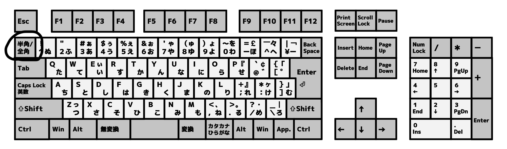

---

## 日本語入力切り替え

* 「無変換」→ IME OFF
* 「変換」→ IME ON
を割り当てたほうが楽！

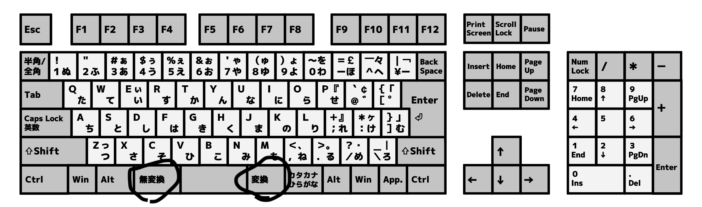

Macbook JIS配列と同じ！現在のIME ON/OFFを意識しなくていいので脳みそにも優しい。

---

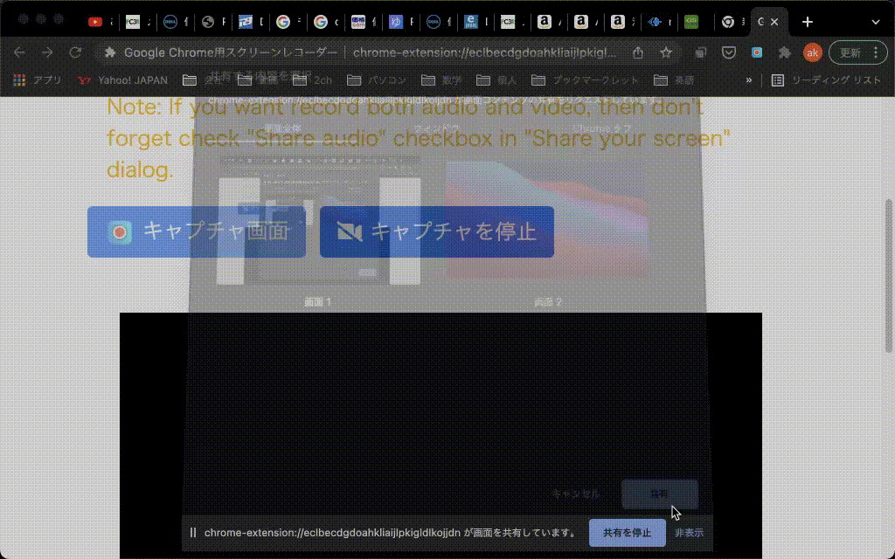

---

## 設定方法

* MS-IME, Google IMEともに設定可能。

詳細はググってください・・・。難しくはないですよ。

---

## カタカナ・英数変換の効率化

F7とかF10キーは押しづらい！
実は各IMEにはCtrlキーを使ったショートカットもある！

---

## カタカナ・英数変換の効率化(続き)

- MS-IME(Windows)
    + `ctrl + t` : 英数
    + `ctrl + i` : 全角カタカナ
- ことえり(MacOS)
    + `ctrl + :` : 英数
    + `ctrl + k` : 全角カタカナ
- Google日本語入力
    + 環境によりマッピングが上記のいずれか

---

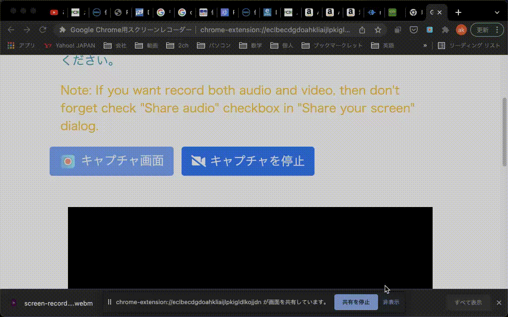

---

## 記号の入力の効率化

- Google日本語入力かことえりで使えるもの。
`z`に続いて何らかの入力を行うと各種記号を入力できる。
特に、矢印記号を入力する際に常用している。
    + `zh` : ←
    + `zj` : ↓
    + `zk` : ↑
    + `zl` : →

---

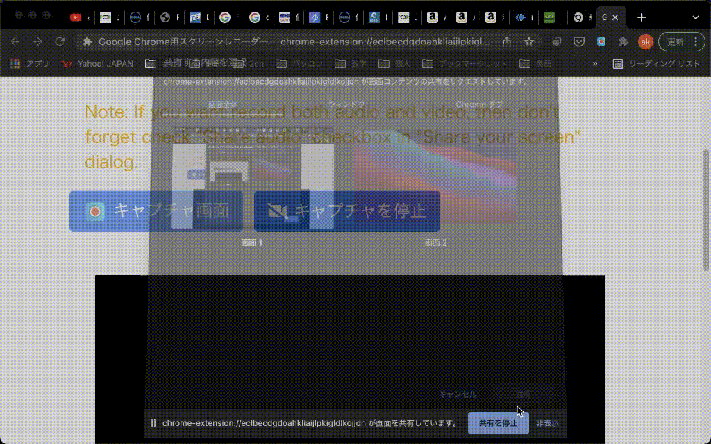

---

## Emacsライクなキーバインド

Unix系のコマンドラインやMacOSのいくつかのアプリで使用可能

+ `ctrl + a` : カーソルを行頭へ移動
+ `ctrl + e` : カーソルを行末へ移動
+ `ctrl + h` : カーソルの左の文字を削除
+ `ctrl + u` : カーソルから行頭までの文字を削除
+ `ctrl + f` : カーソルを右へ移動
+ `ctrl + b` : カーソルを左へ移動
+ `ctrl + m` : Enterキーと同じ

---

## Emacsライクなキーバインド(補足)

- MacOSの場合はKarabiner Elementsを使って、どのアプリでも
上記のキーマッピングをしておくとめちゃくちゃ便利
- 補足：正直、Enter, BackSpace, 矢印, Home, Endキーなんて
最悪の場所に配置されているのでわざわざ指を伸ばすのなんてやってられない。

---

# キーボードフレンドリーなUIたち

---

## ヘルプ表示

基本だけどめちゃくちゃ重要！

+ VSCode: `ctrl + k, ctrl + s` (Macの場合は、ctrlがcmdになる)
+ GitHub: `?` キーを押す
+ Youtube: `?` キーを押す
+ GMail : `?` キーを押す
+ コマンドライン : `man`, `info`, `tldr` (`tldr` がおすすめ)

---

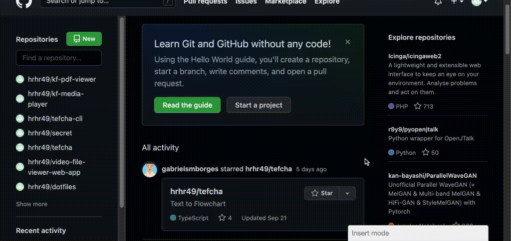

---

---

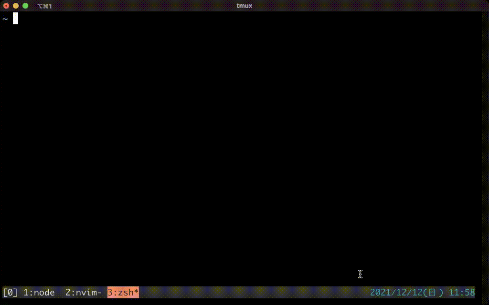

---

## 絞り込み検索

+ Windows
    + Windiwsキー押して、検索・アプリの起動
+ MacOS
    + MacOSのSpotlight検索
+ Linux
    + 標準で入っているアプリランチャー
    + Rofi

---

## 絞り込み検索(続き)

+ Google Chrome
    + タブ検索
        - Windows : `ctrl + shift + a`
        - MacOS: `cmd + shift + a`
    + Vimium (拡張機能)
        - ブックマークの検索
        - タブの検索
        - 補足：FireFox版もある
        - 神！キーボードのみでブラウジング

---

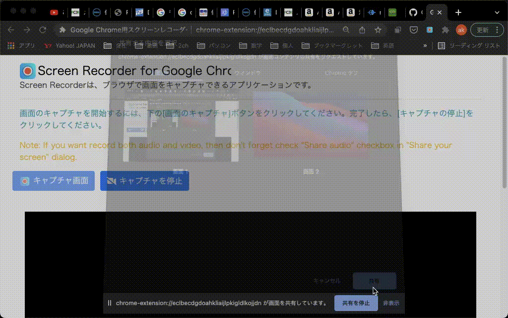

---

---

## 絞り込み検索(続き)

+ コマンドラインツール
    - `fzf` : コマンドの履歴を検索して実行するだけでもめちゃくちゃ便利。
    汎用的に何でも絞り込み検索に流し込めるのでとてつもなく強力。

---

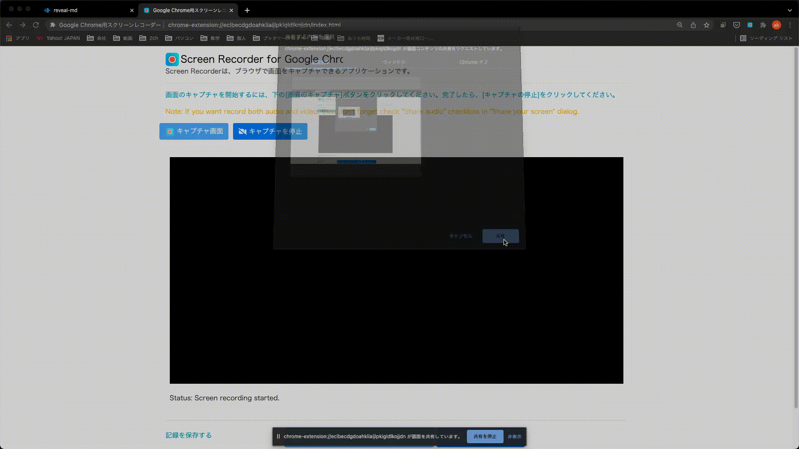

---

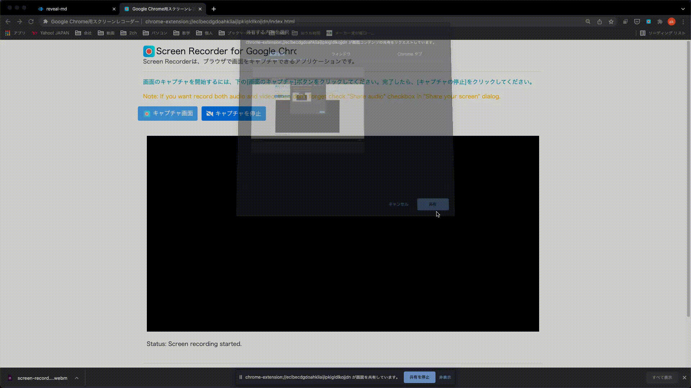

---

## 画面の管理

+ Windows
    + ウィンドウ操作のショートカット
    + ワークスペース機能
    + `Win + 数字` でタスクバーの中の(数字)番目のアプリにフォーカス
    + MicroSoft PowerToysというツールで、ウィンドウ名から絞り込み検索＆フォーカスもできるが、遅い・・・

---

## 画面の管理(続き)

+ MacOS
    + Rectangleというアプリで、ウィンドウの操作のショートカットを追加
    + ウィンドウを他のワークスペースに移動など、ショートカットでできないのは残念
    + Snapで特定アプリにフォーカス
    + Spotlightによるアプリの絞り込み検索＆フォーカス

---

## 画面の管理(続き)

+ Linux
    + タイル型ウィンドウマネージャ
        + i3wm: 新規ウィンドウが、既存のものと重ならないように、自動で画面分割される。
        タブ機能や、ワークスペース機能。フローティングウィンドウ機能などもある。
        扱いは難しいが、なれるとめちゃくちゃ快適！

---

---

## 画面の管理(続き)

+ コマンドラインツール
    + Tmux
+ その他・こういった機能を内包しているアプリ
    + Vivaldi: Webブラウザ。タブ機能だけでなく、画面分割もできる。でも以前使用したときには動作不安定だった

---

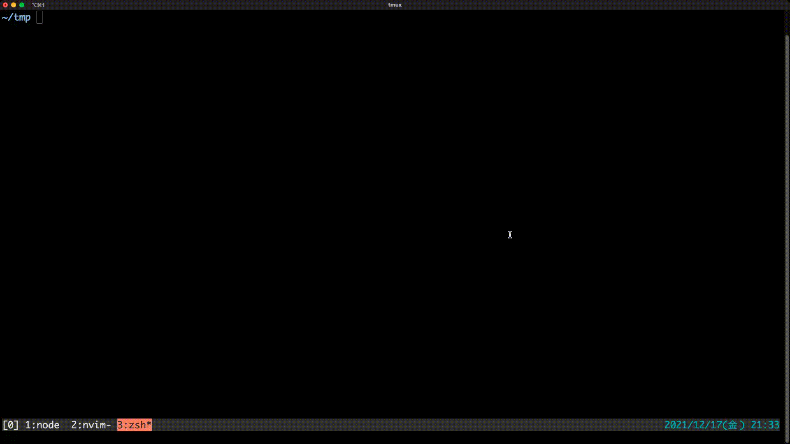

---

## Hit a Hint

特定の項目を選ぶ際に、
各項目に対応するキー文字列が表示され、
対応するキーを押して項目を選べるやつ

+ Windows
    + 標準アプリなどで使用できる、Altキー
+ VSCode
    + MetaGo
+ Vimium
    + リンクを開く
    + リンクのURLをコピー

---

---

終わり。

---

