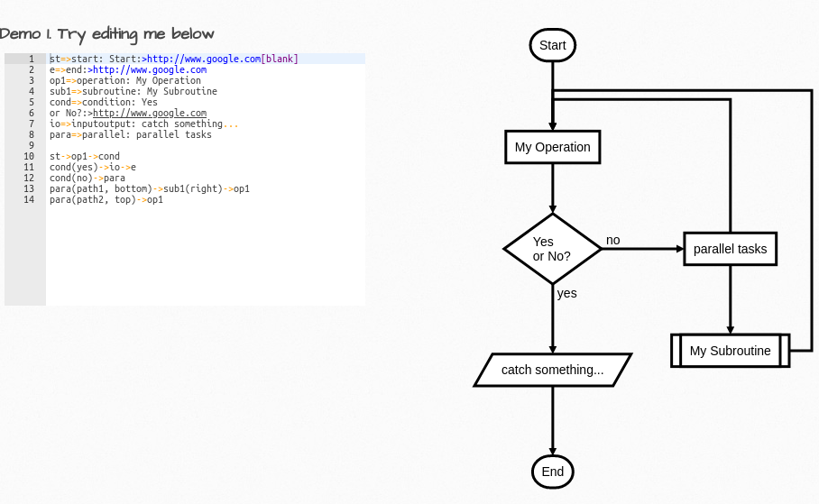

## 自作ツールの紹介
### 〜フローチャート作るやつ〜

---

## どういうツールか？

* 疑似コードを書いたら、それに対応したフローチャートを生成してくれるツール
* リポジトリ https://github.com/hrhr49/tefcha

---


---

## なぜ作ったのか？

* フローチャート作成の効率化
    - どうせ同じ内容をコードに書くのに面倒
* 自分の好きなレイアウトで図を作りたかった
* 出力形式を改造できるようにしたかった
    - 古いExcelしか許されない世界でも強く生きたかった
    (とはいいつつ、Excel図形出力はまだ未対応)。

---

# 既存ツールとの比較

---

## `Mermaid.js`


---

## 採用しなかった理由

* ノード同士のつながりを自分で記述
    - 疑似コードで記述したい
* レイアウトが気に食わない
    - 縦線と横線だけでつなぎたい。
    - dagreというJavaScriptのライブラリに依存

---

## `Flowchart.js`



---

## 採用しなかった理由

* ノード同士のつながりを自分で記述
    - 疑似コードで記述したい
    - 矢印の方向なども自分で記述しないといけない

---

## `PlantUML`


---

## 採用しなかった理由

新構文のアクティビティ図(ベータ版)は求めていたものに近いけど・・・

* continue文に対応していない

おしい・・・  

Excelで扱う形式には対応していないっぽい

---

## `code2flow`


---

## 採用しなかった理由

* 有料(正直そこまでの価値を感じない)
* レイアウトが気に食わない
    - 多分コードは公開されていないが、Graphvizというグラフ描画ライブラリを使っているっぽい。

---

# 開発編

---

## 使ったもの

* 言語: `JavaScript`
    - ブラウザで動かせるようにしたかった
        - 自由にツールを使えない環境での使用
        - 静的ページとしてデモを公開
    - CLIで使えるようにもしたかった
        - Node.jsでも動かせる

---

## 使ったもの(続き)

* AltJS: `TypeScript`
    - 型情報によるLintや入力補完は便利
    - ソースを見るときに型情報がヒントになる
    - そのままだとブラウザやNode.jsで動かないのが地味に面倒
        + 後述のモジュールバンドラーでJSに変換している

---

## 使ったもの(続き)

* モジュールバンドラー: `parcel-bundler`
    - 同様のツールだとWebpackが有名
        + parcelは設定ファイル不要
            - メリット: 気軽
            - デメリット: 拡張性にかける

---

## 使ったもの(続き)

* テストフレームワーク: `jest` (特に `ts-jest`)
    - 選んだ理由は特になし

---

## 使ったもの(続き)

* ブラウザ操作するやつ: `Puppeteer`
    - CLIツールとして使えるようにするために使用
    - `Mermaid.js` のCLIバージョンのコードをリスペクトした(パクった)
    - 正直、ブラウザに依存するコードはほぼないのでできれば外したい・・・

---

## 使わなかったもの

###  グラフ描画ライブラリ

* 既存ツールはレイアウトが気に食わなかった
    - 縦棒、横棒だけで書きたい
    - へんな場所に図形が配置されるのは勘弁
    - 気に食わないとこは改造したい
* 各図形の座標情報などは自分で持ちたい
    - いろいろな出力に対応したい

---

## プログラムの中身について

---

## 疑似コードの扱い

### どうやって構文を解析している？

インデントの個数を数える

```
if a < b
    hoge ← インデント増えたからif文のブロックだ！
else ← インデント減ったからif文のブロック終わり！
    fuga ← インデント増えたからelseのブロックだ！
```

この実装方法は以下の二通り考えられる
* スタックを使う(今回使った方法)
* 関数の再帰呼び出し使う(一般に再帰下降構文解析とか呼ばれる)

---

### 脱線: 構文解析をちゃんとやるなら

本格的に言語処理系を実装するなら、  
パーサジェネレータを使うのが普通

パーサジェネレータとは？

```txt
+------------------------+  変換   +------------+
| 文法を定義したファイル | ------> | 構文解析器 |
+------------------------+         +------------+
```

文法の定義から、
構文解析器を自動で作ってくれるやつ。

---

## 座標の計算はどうやっている？

---

通常の順次処理の場合は四角を上から順に並べるだけ


---

枝分かれがある場合
1. 左の枝から先に計算し、幅を覚えておく
2. 右の枝を計算するときに、その横幅にかぶらないように配置


---

枝を横断する場合(breakやcontinueで必要)

* 枝を描画する際に
    - 図形を配置したy座標のデータを保持
    - 他の枝を描画する際に、y座標がかぶらないように横断する矢印を描画


---

## テスト

* GitHubが提供しているGitHub Actionという `CI/CD` ツールを使用
* `.github/workflows/ファイル名.yml` に設定を書く

---

* GitHub Market Placeで人が作ったいい感じの設定ファイルを持ってこれる


---

## 自動テストの設定

```yml
name: CI
on:
  # master, featureブランチにプッシュやプルリクが
  # あったときにアクションを実行
  push:
    branches:
      - master
      - feature
  pull_request:
    branches:
      - master
      - feature
```

---

## 自動テストの設定(つづき)

```yml
jobs:
  build:
    runs-on: ubuntu-latest
    steps:
    # 該当ブランチへチェックアウト
    - uses: actions/checkout@v2
    # `yarn` コマンドで依存ライブラリをインストール
    - name: Install modules
      run: yarn
    # `yarn test` コマンドでテスト
    - name: Run tests
      run: yarn test
```

---

## `GitHub Action`の画面


---

## パッケージング

公開できるモジュールの形式はいっぱいある。今回のライブラリは以下の形式に対応している

* `CommonJS` (Node.jsから使う。`module.exports` / `require()` )
* `ES Module` (ECMAScript環境を使うとき。 `export` / `import`)
* `UMD` (ブラウザで `<script>` タグで使うとき)

---

各種モジュール形式へのビルド

package.jsonのscriptsフィールド抜粋

```json
{
    "build:umd": "parcel build --experimental-scope-hoisting --detailed-report 10 --target browser browser/main.ts --out-dir umd --out-file tefcha.js",
    "build:cjs": "tsc -p tsconfig.cjs.json",
    "build:esm": "tsc -p tsconfig.esm.json",
    "build": "npm-run-all -p build:*"
}
```

---

# パッケージ公開編

---

## NPM公開手順

1. 公式サイトでnpmアカウント登録
2. README.mdファイルに概要を書く
3. 必要な設定をpackage.jsonに書く(後述)
4. `npm login` コマンドでアカウントにログイン
    * パスワードとメールアドレスを入力
5. `npm publish` コマンドでパッケージを公開！

---

### `package.json` 抜粋

```json
{
  "name": "tefcha", // ライブラリ名
  "version": "0.0.3", // バージョン
  "description": "Text to Flowchart.", // 説明
  "main": "dist/cjs/index.js", // Node.js(CJS)のエントリポイント
  "module": "dist/esm/index.js", // モジュール形式(ESM)のエントリポイント
  "types": "dist/cjs/index.d.js", // TypeScript用の型定義
  "files": [ // Npmに入れるファイル
    "LICENSE",
    // ...略
  ]
  // ...
}
```

---

### `package.json` 抜粋(つづき)

```json
{
    //...
  "keywords": [ // ライブラリの関連ワード
    "flowchart",
    "tefcha"
  ],
  "author": "hrhr49 <hiro49410@gmail.com>", // 作者名
  "license": "MIT", // ライセンス
  "directories": { // ディレクトリ情報
    "test": "tests"
  },
}
```

---

## NPM公開についてその他

* `npm pack` コマンドで、npmに含めるファイルを確認できる。
* 同一バージョンのままだと `npm publish` は失敗する。
ファイルを更新したら必ずversionを上げて `npm publish` する。

---

## CDNの対応

1. NPMパッケージ内に `umd` ディレクトリをつくる
2. `unpkg.com` というサービスがCDNしてくれる

これだけ！

---

## デモページの作成

* GitHub Pagesというサービスを使用
* Gitリポジトリを静的サイトとしてServeしてくれる
* 別の選択肢としてNetlifyとか外部サービスのほうがラクかも
* 現時点(2021/01/24)では無料アカウントだとPublicリポジトリしか使えない

---

## 感想

### 良かったこと

* TypeScriptで、ある程度のバグは事前に防げた
* 無料のサービスだけでも便利
    - GitHub Action (自動テスト)
    - GitHub Pages (デモページのServe)
    - unpkg.com (CDN提供)
* 形あるものを残せた(話のネタになる)

---

### 悪かったこと

* TypeScriptは便利だけど設定が面倒
* JavaScriptは配布するモジュール形式が色々あって面倒
* 結局自分で使う機会がなく、メンテもしてない・・・
    - 機能も貧弱・・・
* 正直あまり需要がないニッチな用途のツール

---

## 参考ページ

* [npmでパッケージを公開してみた手順の記録 - Qiita](https://qiita.com/hoshimado/items/c6f1484297d974f44f19)
* [複数のモジュール形式(CommonJS, ES Modules, UMD)をサポートしたnpmパッケージの作り方 in TypeScript](https://hatenablog-parts.com/embed?url=https%3A%2F%2Fwebpack.js.org%2Fguides%2Ftree-shaking%2F)
* [mjackson/unpkg: The CDN for everything on npm](https://github.com/mjackson/unpkg)
* [mermaid.js](https://mermaid-js.github.io/mermaid/#/)
* [flowchart.js](https://flowchart.js.org/)
* [plantuml](https://plantuml.com/ja/)
* [code2flow](https://code2flow.com/)
