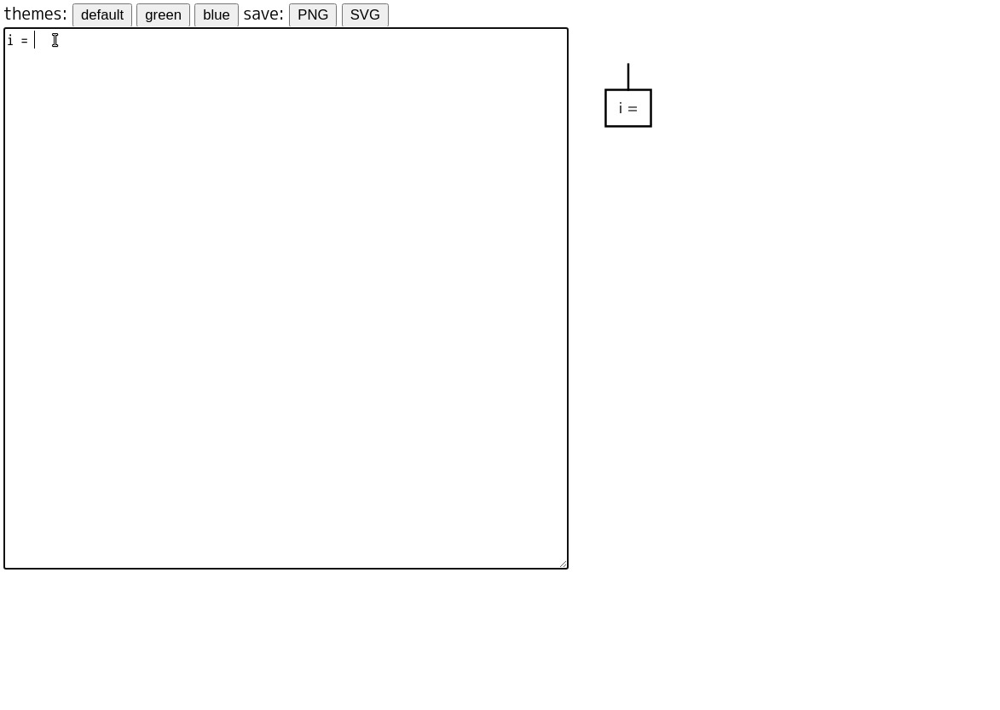

<style type="text/css">
  .reveal p {
    text-align: left;
  }
  .reveal ul {
    display: block;
  }
  .reveal ol {
    display: block;
  }
  .reveal h1, .reveal h2, .reveal h3, .reveal h4, .reveal h5 {
    text-transform: none;
  }
</style>

## 以前紹介したツールの更新

### 〜フローチャート作るやつ〜

---

## 復習: どういうツールか？

* 疑似コードを書いたら、それに対応したフローチャートを生成してくれるツール
* リポジトリ https://github.com/hrhr49/tefcha

* Text to Flowchart を略して `Tefcha` というツール名にした。
    - (グーグラビリティも考慮)

---

こんなやつ



---

## 背景

半年ぐらい放置してたが、最近ちょくちょく  
更新したので、その内容を今回、話します。

---

## 今回の内容

1. 追加した機能の紹介
2. ちょっとしたテストの効率化
3. いい感じなツール化(今回のメイン)

---

# 1. 追加した機能

---

### 構文を追加しました。

---

## `Switch-Case` 文

```
switch fruit
  case apple
    red
  case banana
    yellow
  case grape
    purple
end
```


---

## `Try-Except` 文

```
try
  calculate()
except ValueError
  invalid value
except ZeroDivisionError
  value must be != 0
end
```


---

## 2. ちょっとしたテストの効率化

---

機能を追加するのはいいけど、  
テストが地味に面倒・・・。

ある程度は目で見て動作確認していた。

---

## テストで面倒なこと

* コーナーケースとなる入力(コード)を用意
* レンダリング結果を確認
    - 文字や線が意図せず重ならない？
    - 描画する線の過不足ない？
        + ブロック内でbreak, continueした場合とか
    - 描画する座標がずれたり、計算ミスしてない？


---

# そこで・・・

---

## 入力コードの自動生成

テストの入力となるコードを自動生成すれば以下のメリットがある。

* 自分で気づかないケースも網羅できる可能性がある。
* 手軽に、高速に、大量の入力データを作成できる。

* 「ファジングテスト」的な考え

---

## どうやってコードを自動生成？

コード自体はブロックによる再帰的な構造を持っているので、
再帰関数で実装できる。

* 生成するコードの行数を入力として受け取り、
再帰呼び出しするたびに、その行数を減らしていく。
* 行数が0だったら、空のコードを出力

---

## 例

if文を使った場合

```
if hoge
  (このブロック内のコードは再帰的に生成)
```

if-else文を使った場合

```
if hoge
  (このブロック内のコードは再帰的に生成)
else
  (このブロック内のコードは再帰的に生成)
```

---

## 生成したコード


---

## 生成したフローチャート


---

## どうやって確認？

1. 各図形や線を描画する座標データをJSON形式で保存する
2. JSONデータに対し、確認用スクリプト実行
  - 各水平線同士で、距離を測ってちゃんと離れているかなど
3. その他、目視である程度確認する。
  - 意図しない問題が見つかるかもしれない

---

# 3. いい感じな  
# ツール化

---

使うために作ったツールなので、  
ちゃんとしたUIを用意しようと思った。

---

## こんな感じ


---

## 使ったもの

* Webフロントエンドのフレームワーク: `React`
* Reactコンポーネント: `Material-UI`
* フォームの作成・バリデーション:   
  `react-jsonschema-form`
* テキストエディター部分: `Ace Editor`
* 開発言語: `TypeScript`

---

## Reactとは？

ユーザインターフェース構築のための JavaScript ライブラリ(公式ページより)

特徴  
* 宣言的なView
* コンポーネントベース
* 一度学習すれば、どこでも使える

---

JSソースコード内に、HTMLのような記法を使用できる、
JSXという記法を用いてコンポーネントを作る。

```jsx
class ShoppingList extends React.Component {
  render() {
    return (
      <div className="shopping-list">
        <h1>Shopping List for {this.props.name}</h1>
        <ul>
          <li>Instagram</li>
          <li>WhatsApp</li>
          <li>Oculus</li>
        </ul>
      </div>
    );
  }
}

// Example usage: <ShoppingList name="Mark" />
```

---

## Reactの採用事例

* Netflix
* Slack
* Uber
* Airbnb
* Paypal

---

## Material-UIとは

Reactコンポーネントを提供するフレームワーク  
Googleが提唱するマテリアルデザインを採用している。


---

## Material-UIの採用事例

* NASA
* UNIQLO
* Netflix
* Amazon
* Unity
* Spotify

---

## react-jsonschema-formとは

### そもそも、JSON Schemaとは

JSONの構造を定義するための記法。
こいつ自体もJSON形式で書く。

---

たとえば、以下のようなデータを考える

```json
{
  "age": 40,
  "name": "Taro Yamada"
}
```

* age: 数値型のデータ
* name: 文字列型のデータ

---

先程のようなデータは、以下のように表せる。

```json
{
  "$schema": "http://json-schema.org/draft-04/schema#",
  "type": "object",
  "properties": {
    "age": {
      "type": "integer"
    },
    "name": {
      "type": "string"
    }
  },
  "required": [
    "age",
    "name"
  ]
}
```

---

## JSON Schema定義に便利なサービス

Free Online JSON to JSON Schema Converter  
https://www.liquid-technologies.com/online-json-to-schema-converter

* JSONデータを入力に与えると、そこから、JSON Schema定義を作ってくれる。
* できたやつを用途に合わせて微修正すれば良い。

---


---


---

## react-jsonschema-formとは

JSON Schemaから、フォームを自動生成


---

## 今回使った場所


---

## Ace Editorとは

* ブラウザで使えるJavaScript製のテキストエディタ  
* `Cloud9 IDE` という、クラウドベースのIDEで使われている。

* あとから知ったが、 Microsoftが作っている `Monaco Editor` も良さそう。
こっちは VSCodeで使われている。

---

## 今回使った場所


---

## おまけ: PWA対応

今回作ったツールは、デスクトップPWAに対応した。
なお、現在はPC版のGoogle Chrome用しか用意していない。

アドレスバーに「インストール」アイコンが表示される


---

## おまけ: PWA対応(続き)

PWA対応には以下のものを用意する必要がある

* `manifest.webmanifest` もしくは `manifest.json`
* アイコン画像
* サービスワーカー(オフライン対応したい場合)

---

## 感想

### 良かったこと

* フロントエンド関連の知識で形に残るものを作れた
* 少しは使いやすくなったと思う

---

### 悪かったこと

* まだ使いやすさという点で課題あり
  - UIの配置場所が地味に煩わしい
  - 特定のプラットフォームだと動かない
  - まだまだUIの機能不足

---

## 参考ページ

* React: https://ja.reactjs.org/
* Material-UI: https://material-ui.com/
* Free Online JSON to JSON Schema Converter: https://www.liquid-technologies.com/online-json-to-schema-converter
* react-jsonschema-form: https://github.com/rjsf-team/react-jsonschema-form
* Ace Editor: https://ace.c9.io/

---

## 作ったもの

* GitHubページ: https://github.com/hrhr49/tefcha
* デモページ: https://hrhr49.github.io/tefcha/examples/rich-editor/dist/

